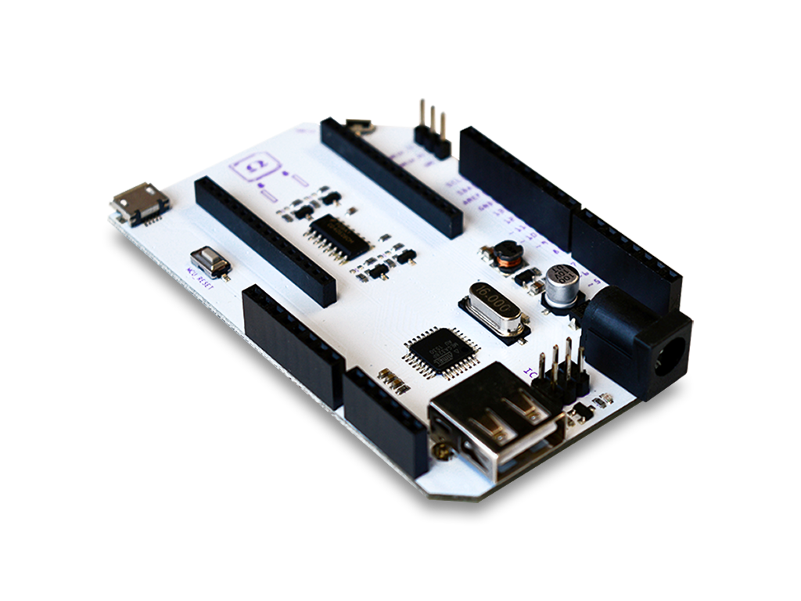
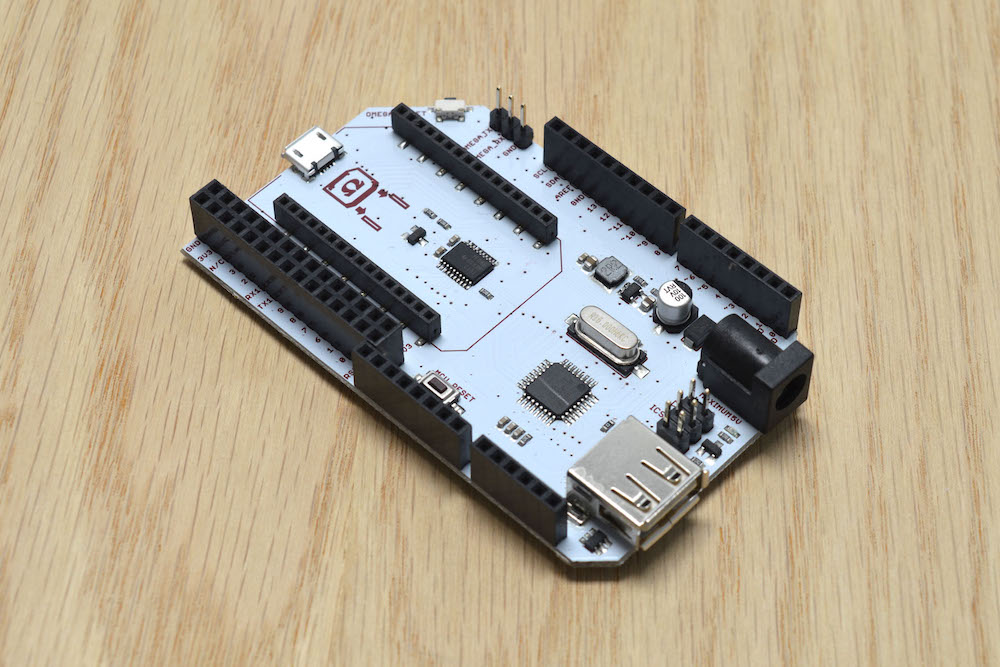

# Onion-Arduino-Library

Onion library for use with the Arduino IDE and the Arduino Dock. 

Combine the ease of use of Arduino with the flexibility and power of Linux with the Onion Omega!

## Arduino Dock Documentation

Full and up-to-date documentation can be found in our docs site:

* https://docs.onion.io
* https://docs.onion.io/omega2-docs/arduino-dock-2.html
* https://docs.onion.io/omega2-docs/flash-arduino-dock-wirelessly.html#flash-arduino-dock-wirelessly

## Contents

This library contains code needed to flash the Arduino Dock R1 model, as well as example sketches that showcase how the Atmel microcontroller and Omega can exchange data and commands.

### Library Functions

Coming soon!

### Example Sketches

You can find example sketches by clicking on `File -> Examples -> Onion`.

### Preparing to Flash

**Note**: The Arduino Dock does **not** have an onboard USB to serial converter. You will need an [Onion Omega-type board](https://onion.io/buy/) (Omega1, Omega2, Omega2+) to flash Arduino code to the Dock.

The flashing process will depend if you are using the first model of the Dock (R1) or the second (R2).

Arduino Dock R1:



Arduino Dock R2 (note the Expansion Header in the left corner of the board):



See the sections below for how to use the library for each model.

#### Model R1

In your sketch, add the Onion Library by clicking in the top menu bar: `Sketch -> Include Library -> Onion`.


Once the library has been added, create a global instance of the Onion object. Add the following line on the global scope:

```
Onion* onionSetup;
```

To initialize and activate the library functions, add the following line to the `setup()` function in the sketch:

```
onionSetup = new Onion();
```

#### Model R2

We've made sweeping improvements in this revision, so you don't have to include the library to flash it; no additional steps are needed! :)

### Flashing the Arduino Dock

Follow the instructions in our Arduino Dock documentation: 

https://docs.onion.io/omega2-docs/flash-arduino-dock-wirelessly.html

<!-- ## Installation Instructions

* Clone the [Onion Arduino Library repo](https://github.com/OnionIoT/Onion-Arduino-Library) to your computer
* Open the Arduino IDE
  * Open the Sketch Menu, and then Include Library -> Add .ZIP Library
  
  * Navigate to where the Onion Arduino Library repo has been cloned
  * Select Onion-Arduino-Library.zip
* The library is now installed, it can be included in your sketches by opening the Sketch menu -> Include Library -> Onion 

 -->
